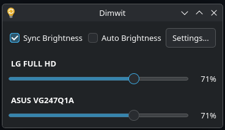
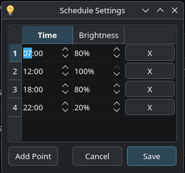

# Dimwit

<p align="center">
  
</p>

Dimwit is a native Linux system tray application for controlling the brightness of external monitors using DDC/CI. It allows for per-monitor control, synchronous brightness adjustment across all displays, and an automated daytime scheduling feature.

> [!NOTE]  
> Please note that this application has been developed with the use of local LLMs and Gemini for the purpose of trying the tools.


## Features

- **Per-Monitor Control**: Adjust brightness sliders for each connected display individually.
- **Sync Brightness**: Link all monitor sliders to change brightness across all screens simultaneously.
- **Auto-Brightness Schedule**: Define a schedule to automatically interpolate brightness levels throughout the day.
- **System Tray Integration**: Stays out of the way in your system tray for quick access.

## Screenshots

<p align="center" style="display: flex; justify-content: center; align-items: center; gap: 10px;">



</p>

## Prerequisites

To build and run Dimwit, you need to install some dependencies:

On Ubuntu/Debian, you can typically install these with:
```bash
sudo apt update
sudo apt install build-essential cmake qt6-base-dev libddcutil-dev ddcutil
```

On Arch Linux, you can install them with:
```bash
sudo pacman -S base-devel cmake qt6-base ddcutil
```

## Building

1. Clone the repository:
   ```bash
   git clone https://github.com/FoolHen/dimwit.git
   cd dimwit
   ```

2. Create a build directory and compile:
   ```bash
   mkdir build
   cd build
   cmake ..
   cmake --build .
   ```

## Running

After building, you can run the application directly from the build directory:
```bash
./Dimwit
```

> [!TIP]
> If you want to use the auto-brightness schedule, don't forget to add the application to your startup applications.

## Configuration

The auto-brightness schedule and settings are stored in:
`~/.config/dimwit/schedule.json`

## Troubleshooting

### DDC/CI Permissions 

Dimwit requires access to the I2C bus to communicate with your monitors. Some Linux distros don't allow non-root users to access it by default. In that situation, this might help:

1. **Add your user to the `i2c` group**:
   ```bash
   sudo usermod -aG i2c $USER
   ```
2. **Ensure the `i2c-dev` module is loaded**:
   ```bash
   sudo modprobe i2c-dev
   ```
   *To make this permanent, add `i2c-dev` to a file in `/etc/modules-load.d/`.*

3. **Log out and log back in** (or reboot) for the new group membership to take effect. 


## License
This project is licensed under the conditions specified in the [LICENSE.md](LICENSE.md) file.
